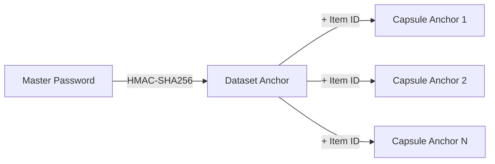

# CIAF Core Concepts

## Overview

CIAF is built on several core concepts that work together to provide verifiable AI system provenance.

## Anchoring System

### Master Password → Dataset Anchor → Capsule Anchor



**Master Password**: High-entropy secret that serves as the root of trust
**Dataset Anchor**: Cryptographic identifier for a dataset derived from master password
**Capsule Anchor**: Unique identifier for each data item derived from dataset anchor

### Properties

- **Deterministic**: Same inputs always produce same anchors
- **Hierarchical**: Clear derivation chain from master to capsule
- **Secure**: Uses HMAC-SHA256 for cryptographic strength
- **Verifiable**: Anyone with the anchor can verify derivation

## Lazy Capsule Materialization (LCM)

### Concept

Instead of storing all data and proofs upfront, CIAF materializes them on-demand:

```python
# Traditional approach: store everything
all_capsules = [create_capsule(item) for item in huge_dataset]  # Memory intensive

# LCM approach: generate on-demand
lazy_manager = LCMLazyManager(dataset_anchor)
capsule = lazy_manager.materialize_capsule("item_001")  # Generate only when needed
```

### Benefits

- **Memory Efficient**: Don't store what you don't need
- **Cryptographically Sound**: Each capsule is deterministically derivable
- **Scalable**: Handle datasets of any size
- **Verifiable**: Materialized capsules are cryptographically verifiable

## Merkle Trees

### Structure

CIAF uses binary Merkle trees for tamper-evident data structures:

```
       Root Hash
      /          \
   Hash AB      Hash CD
   /    \       /     \
Hash A Hash B Hash C Hash D
  |     |       |      |
 Data  Data    Data   Data
```

### Policies

CIAF enforces consistent Merkle tree policies:

- **Leaf Canonicalization**: Deterministic leaf ordering and formatting
- **Hash Function**: SHA-256 for all internal nodes
- **Fanout**: Binary tree (2 children per node)
- **Padding**: Right-side duplication for uneven leaf counts

## Model Anchoring

### Parameter Fingerprinting

Model parameters are fingerprinted for immutable tracking:

```python
parameters = {"epochs": 100, "lr": 0.001, "batch_size": 32}
fingerprint = sha256_hash(json.dumps(parameters, sort_keys=True))
```

### Architecture Fingerprinting

Model architecture is separately fingerprinted:

```python
architecture = {"type": "transformer", "layers": 12, "hidden": 768}
fingerprint = sha256_hash(json.dumps(architecture, sort_keys=True))
```

### Benefits

- **Immutable**: Changes to parameters/architecture are detectable
- **Verifiable**: Anyone can recompute fingerprints
- **Granular**: Separate tracking of parameters vs architecture

## Audit Trails

### Hash Chaining

Audit events are linked in a hash chain:

```
Event 1: hash = SHA256(event_data + "0000...0000")
Event 2: hash = SHA256(event_data + Event1.hash)
Event 3: hash = SHA256(event_data + Event2.hash)
```

### Properties

- **Tamper Evident**: Changes to any event break the chain
- **Append Only**: New events extend the chain
- **Verifiable**: Chain integrity can be independently verified
- **Auditable**: Complete history from genesis to current

## Training Snapshots

### Composition

A training snapshot captures the complete state at training time:

```json
{
  "snapshot_id": "unique_identifier",
  "dataset_anchor": "cryptographic_dataset_id",
  "model_anchor": "model_fingerprints",
  "training_params": "hyperparameters",
  "merkle_root": "data_integrity_proof",
  "timestamp": "when_training_occurred"
}
```

### Integrity

Snapshots are cryptographically linked to:
- Dataset through anchors and Merkle roots
- Model through parameter/architecture fingerprints
- Training process through audit events

## Inference Receipts

### Structure

Each inference produces a verifiable receipt:

```json
{
  "inference_id": "unique_identifier",
  "training_snapshot": "reference_to_training",
  "input_hash": "hash_of_input_data",
  "output_hash": "hash_of_model_output",
  "timestamp": "when_inference_occurred",
  "audit_event": "link_to_audit_chain"
}
```

### Verification

Receipts can be independently verified:
1. Training snapshot integrity
2. Input/output hash correctness
3. Audit chain linkage
4. Timestamp validation

## Compliance Integration

### Mapping Strategy

CIAF maps its cryptographic primitives to regulatory requirements:

| Regulation | CIAF Component | Mapping |
|------------|----------------|---------|
| EU AI Act | Risk Management | Audit trails + bias detection |
| NIST AI RMF | System Inventory | Model anchoring + receipts |
| GDPR | Data Protection | Consent tracking + minimization |
| HIPAA | PHI Protection | Anchor-based access controls |

### Flexibility

- **Framework Agnostic**: Core primitives map to multiple regulations
- **Extensible**: New compliance requirements can be layered on
- **Verifiable**: Compliance claims are cryptographically backed