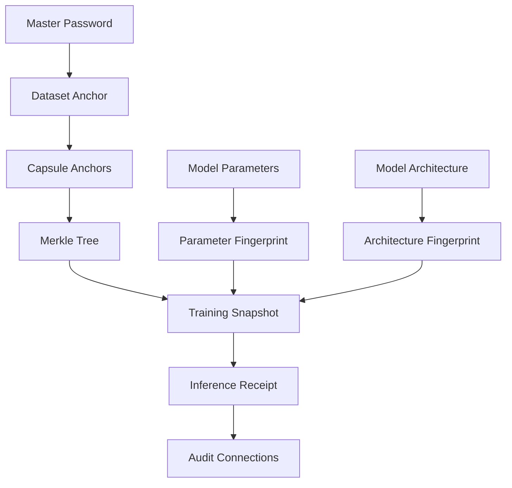

# CIAF Documentation

Welcome to the Cognitive Insight Audit Framework (CIAF) documentation.

## Quick Navigation

- [Concepts](concepts.md) - Core concepts and cryptographic foundations
- [Quickstart](quickstart.md) - Get started with CIAF in 5 minutes
- [Receipts Schema](receipts.md) - Understanding CIAF receipts and artifacts
- [Compliance Mapping](compliance-mapping.md) - Regulatory framework mapping
- [Security Model](security.md) - Security assumptions and threat model

## Overview

CIAF provides cryptographically verifiable provenance tracking for AI systems with:

- **Dataset Anchoring**: Cryptographic roots for data lineage
- **Lazy Capsule Materialization**: Efficient on-demand proof generation
- **Model Anchoring**: Immutable parameter and architecture fingerprinting
- **Audit Trails**: Hash-connected event logging
- **Compliance Mapping**: Ready-to-use regulatory framework mappings

## Architecture



## Getting Started

1. **Install CIAF**:
   ```bash
   pip install -e .
   ```

2. **Run the quickstart**:
   ```bash
   python examples/quickstart.py
   ```

3. **Verify receipts**:
   ```bash
   python tools/verify_receipt.py sample_receipt.json
   ```

## Core Features

### 🔒 Cryptographic Security
- AES-256-GCM authenticated encryption
- SHA-256 hashing for integrity
- HMAC-SHA-256 for anchor derivation
- Secure random generation

### ⚓ Anchoring System
- Hierarchical anchor derivation
- Deterministic capsule generation
- Lazy materialization patterns

### 📊 Compliance Ready
- EU AI Act mappings
- NIST AI RMF support
- GDPR/HIPAA patterns
- SOX and ISO 27001 controls

### 🔍 Verifiable Artifacts
- Independent receipt verification
- Merkle proof validation
- Audit connections integrity checks

## Support

- **Issues**: [GitHub Issues](https://github.com/DenzilGreenwood/pyciaf/issues)
- **Discussions**: [GitHub Discussions](https://github.com/DenzilGreenwood/pyciaf/discussions)
- **Security**: [Security Policy](../ciaf/SECURITY.md)